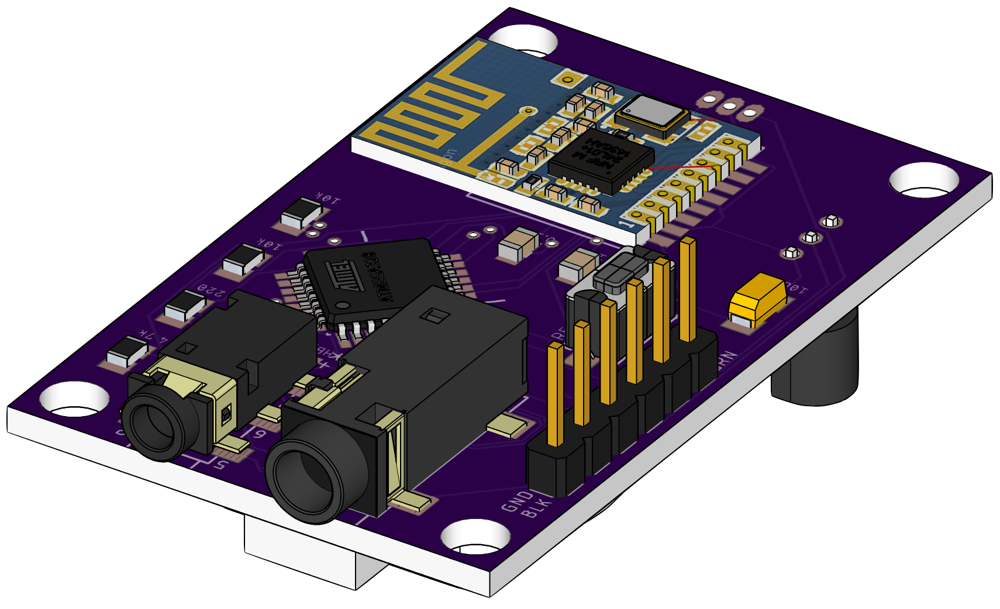

## Wireless Lab Monitor ##
A simple MySensors-based, network-connected telemetry device for monitoring status of equipment in a biological laboratory setting.

### Rationale ###
Biological experiments are important. Biological experiments are sensitive to changes in temperature, humidity, and lots of other things. Let's use a bit of IoT technology for good instead of evil, shall we?

This initial prototype sensor will look after things like incubators and autoclaves to take note of the status of their doors and temperatures in an effort to keep their contents safe and viable.

### System Design ###
The sensors will communicate through a [MySensors](https://www.mysensors.org)-based gateway running on a [Raspberry Pi Model 3](https://www.raspberrypi.org/products/raspberry-pi-3-model-b/). This gateway box then sends the gathered telemetry data to a server via the [MQTT](http://mqtt.org) protocol where it is stored in a local database and presented through a web interface and a corresponding RESTful API.

### Hardware Description - Single Item Sensor ###
The prototype uses a standard surface mount [Microchip/Atmel ATmega328p](https://www.microchip.com/wwwproducts/en/ATMEGA328) in a TQFP32 package, coupled with a [Nordic Semiconductor nRF24L01 Tranceiver](https://www.nordicsemi.com/eng/Products/2.4GHz-RF/nRF24L01P) to communicate with the aforementional backend server. Sensor hardware includes temperature sensors ([Dallas/Maxim DS18b20 Digital Thermometer](https://www.maximintegrated.com/en/products/analog/sensors-and-sensor-interface/DS18B20.html)) along with Hall-effect-based position sensors ([Allegro A1104](https://www.allegromicro.com/en/Products/Magnetic-Digital-Position-Sensor-ICs/Hall-Effect-Unipolar-Switches/A1101-2-3-4-6.aspx) or similar) for door open/closed status detection. Jacks are provided to add external versions of the same sensors if placement is an issue.

#### Parts Manifest ####
Quantity | Value         |        Name        |        Package
-------: | ------------- | :----------------: | -------------:
       1 | ATMEGA328P-AU |   Microprocessor   |           TQFP
       2 | 10uF          |    Tantalum Cap    |           1206
       4 | 0.1uF         |     Capacitor      |           0805
       1 | green         |        LED         |           0603
       3 | 10kΩ          |      Resistor      |           0805
       1 | 4.7kΩ         |      Resistor      |           0805
       1 | 220Ω          |      Resistor      |           0805
       1 | CR2032        |   Battery Holder   |
       1 | 2.5mm         |     Audio Jack     |         PJ-242
       1 | 3.5mm         |     Audio Jack     |         PJ-328
       1 |               |     SMT Switch     |
       1 |               | Temperature Sensor |        DS18B20
       1 |               | Hall-Effect Sensor |          A3144
       1 | 1x6           |     Pin Header     | FTDI Interface
       1 | NRF24         |       Radio        |       Mini SMT

#### Layout ####
   
